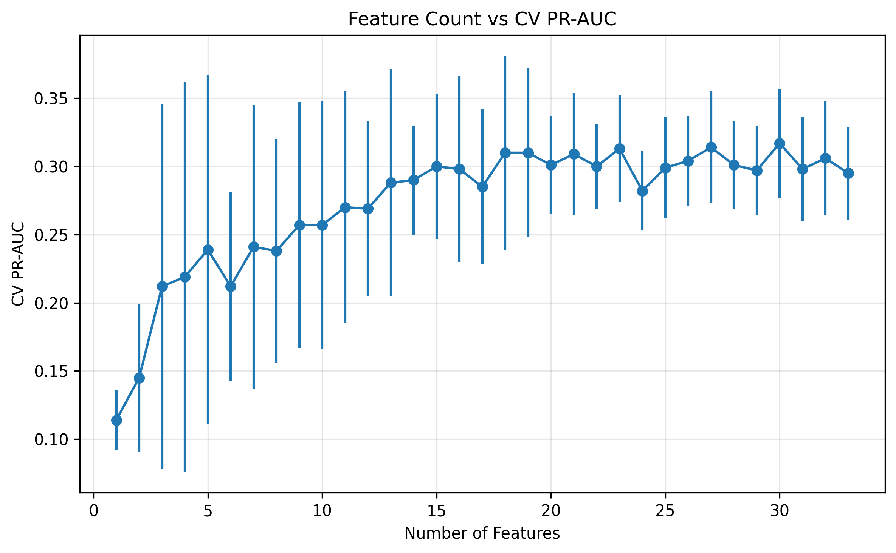

# SECOM Manufacturing Failure Prediction

## Objective

Develop machine learning models to predict semiconductor manufacturing failures using the UCI SECOM dataset.

The SECOM dataset contains 1,567 manufacturing observations with 590 process sensor measurements and a highly imbalanced target variable (~6.6% failure rate).

---

## Dataset Challenges

- High-dimensional feature space (590 sensors)
- Significant missing data
- Strong feature correlation and redundancy
- Severe class imbalance
- Limited number of failure examples

---

## Preprocessing

### Missing Data Handling

- Removed features with >90% missing values
- Applied median imputation to remaining missing values

### Feature Reduction

- Removed constant and near-constant features
- Removed highly correlated features
- Evaluated feature relevance using mutual information and model-based importance measures

### Model Evaluation

- Stratified train/test splitting
- Leakage-safe cross-validation
- ROC-AUC evaluation
- Precision-Recall AUC evaluation
- Threshold analysis for imbalanced classification

---

## Models Explored

- L1-Regularized Logistic Regression
- Random Forest
- XGBoost
- Histogram Gradient Boosting
- Support Vector Machines
- Partial Least Squares Discriminant Analysis

---

## Results Summary

The final model was a tuned Random Forest using a leakage-safe preprocessing pipeline. Model selection and threshold selection were performed using training data only, then the model was evaluated on the held-out test set.

On the holdout set, the final model achieved:

- ROC-AUC: 0.759
- PR-AUC: 0.214
- Precision: 0.286
- Recall: 0.286
- Flagged rate: 6.7%
- Enrichment: 4.3x the baseline failure rate

The full project summary is available in [tables/project_summary.md](tables/project_summary.md), and the reduced-feature model comparison is available in [tables/reduced_feature_results.md](tables/reduced_feature_results.md).

The baseline model comparison showed that tree-based ensemble methods performed better than linear models under cross-validation. Those results are summarized in [tables/model_performance_summary.md](tables/model_performance_summary.md).

The reduced-feature experiments were treated as exploratory. They showed that feature reduction can improve cross-validated PR-AUC, but the best feature count was not stable on the holdout set. Training-only cross-validation favored a smaller reduced model, while a post-hoc holdout sweep favored a broader feature set. Because the holdout set contains only a small number of failures, these differences should be interpreted cautiously rather than as proof of one exact optimal feature count.



The final model still reflects the difficulty of the problem. Failures are rare, and the model is better interpreted as a risk-ranking tool than as a deterministic pass/fail classifier.

---

## Exploratory Data Analysis Findings

A comprehensive exploratory analysis was performed to better understand the structure of the SECOM dataset before model development.

Methods explored included:

- Principal Component Analysis (PCA)
- Partial Least Squares (PLS)
- UMAP
- t-SNE
- Kernel PCA
- Gaussian Mixture Models (GMM)
- Sensor-level risk analysis
- Correlation analysis
- Mutual information analysis

Several consistent findings emerged:

- No clear failure cluster was observed in PCA, UMAP, t-SNE, Kernel PCA, or GMM visualizations.
- Failures appear throughout the sensor space rather than forming a distinct population.
- Multiple supervised and unsupervised methods repeatedly identified a small group of sensors as being associated with elevated failure risk.
- Certain regions of sensor space showed failure rates 2-3x higher than the baseline failure rate, indicating localized process regimes with increased risk.
- A Gaussian Mixture Model identified an elevated-risk process regime with approximately twice the baseline failure rate, further supporting the presence of probabilistic rather than deterministic failure behavior.

Overall, the evidence suggests that manufacturing failures are not driven by a single separable failure mode. Instead, failures occur across overlapping process conditions where risk increases in specific regions of the sensor space.

Example EDA figures:

- [PCA cumulative explained variance](figures/pca_cumulative_explained_variance.png)
- [PCA PC1/PC2 projection](figures/pca_pc1_pc2_projection.png)
- [UMAP projection](figures/umap_projection.png)
- [Attribute 104 failure rate by sensor decile](figures/failure_rate_decile_Attribute_104.png)
- [Attribute 60 failure rate by sensor decile](figures/failure_rate_decile_Attribute_60.png)

---

## Model Interpretation

Feature importance was evaluated using Random Forest impurity importance, cross-validated permutation importance, and cross-validation stability checks. Attribute 104 was the strongest feature across both Random Forest importance and cross-validated permutation importance. Other recurring sensors included Attributes 60, 34, 32, 65, 66, 206, 214, 248, and 511.

Key interpretation figures:

- [Random Forest feature importance, top 20](figures/rf_feature_importance_top20.png)
- [Cross-validated permutation importance, top 20](figures/permutation_importance_top20.png)
- [Tuned Random Forest ROC curve](figures/tuned_rf_roc_curve.png)
- [Tuned Random Forest precision-recall curve](figures/tuned_rf_precision_recall_curve.png)
- [Cross-validated threshold tradeoff](figures/cv_threshold_tradeoff.png)

Threshold selection was performed using out-of-fold predictions from the training data. This avoids using the holdout set to choose the classification cutoff and gives a more realistic view of the precision, recall, and flagged-rate tradeoff.

---

## Reproduce

Install the project environment with:

```bash
uv sync
```

Run the notebooks in order:

1. `notebooks/00-data-exploration.ipynb`
2. `notebooks/01-modeling.ipynb`

Saved figures are written to `figures/`, and summary tables are written to `tables/`.

---

## Final Takeaway

The project demonstrates that meaningful failure prediction is possible on the SECOM dataset, but the signal is subtle. The strongest result is a leakage-safe Random Forest that ranks wafer risk above baseline. Reduced-feature modeling suggests that useful information is concentrated in a recurring subset of process sensors, but the exact feature count should be treated as exploratory rather than definitive.
